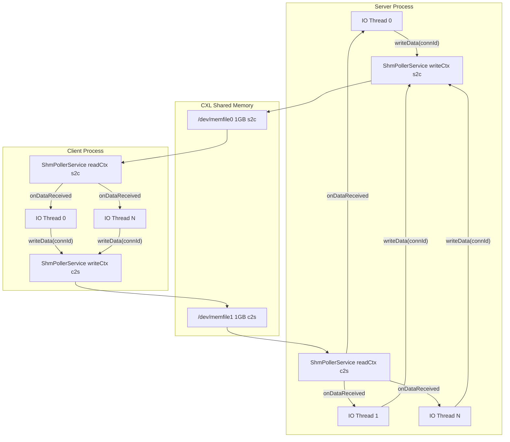

# CXL Shared Memory Transport -- Architecture & Implementation Guide

Branch: `feature/shm-busypoll-transport`
Repos: `folly` (transport infra) + `fbthrift` (RPC framework integration)

---

## 1. Project Goal

Replace TCP socket transport for Thrift RPC with an ultra-low-latency path based on CXL memory device files (`/dev/memfile0`, `/dev/memfile1`). A single GQM queue and shared data ring buffer per direction serve all connections, with one dedicated poller thread per direction.

## 2. Architecture Overview



## 3. Memory Layout (cross-cursor for NC+CC)

Each memfile is NC-written by exactly one side. writeCursor for this
direction and readCursor for the OPPOSITE direction both live in the
same memfile, so every shared-memory write is NC (noncacheable).

```
/dev/memfile0 (Server NC writes)
+--------------------------------------------------------------+
| [0, 32KB)          GQM region (s2c, depth 496)               |
| [32KB, 32KB+64)    s2c writeCursor  (Server NC write)        |
| [32KB+64, 32KB+128) c2s readCursor  (Server NC write)        |
| [32KB+128, ~1GB)   s2c ring buffer payload                   |
+--------------------------------------------------------------+

/dev/memfile1 (Client NC writes)
+--------------------------------------------------------------+
| [0, 32KB)          GQM region (c2s, depth 496)               |
| [32KB, 32KB+64)    c2s writeCursor  (Client NC write)        |
| [32KB+64, 32KB+128) s2c readCursor  (Client NC write)        |
| [32KB+128, ~1GB)   c2s ring buffer payload                   |
+--------------------------------------------------------------+
```

- GQM: 1 per direction, depth 496, all connections shared
- Cursors: 128 bytes (2 cachelines) per memfile; cross-linked so
  readCursor always lives in the reader's own NC-written memfile
- Data ring: ~1GB - 32KB - 128B, pure payload, no per-chunk headers

## 4. Key Data Structures

### GqmNotification (64-bit encoding)

```
Bit layout:
  [63:48]  connId  -- 16 bits, max 65535 connections/poller
  [47:16]  offset  -- 32 bits, max 4 GB
  [15:0]   length  -- 16 bits, max 65535 bytes (~64 KB/chunk)
```

File: `folly/folly/io/async/GqmInterface.h`

### Per-direction cursor pointers (cross-linked)

```cpp
struct DirectionContext {
  std::atomic<uint64_t>* writeCursor;  // in this direction's memfile (+0)
  std::atomic<uint64_t>* readCursor;   // in opposite direction's memfile (+64)
  // ...
};
```

writeCursor and readCursor may point into different memfiles.
After `initFromProvider`, readCursor is cross-linked to the opposite
direction's memfile so that it is always NC-written by the reader side.

File: `folly/folly/io/async/ShmPollerService.h`

## 5. Data Flow

### Write Path (any IO thread)

```
1. Spin until freeSpace = usableSize - (writeCursor - readCursor) >= chunkLen
2. cursor = writeCursor.fetch_add(chunkLen)
3. offset = cursor % usableSize
4. memcpy payload -> ringBase[offset]  (handle wrap-around)
5. gqm->push({connId, offset, chunkLen})
```

### Read Path (poller thread)

```
1. notif = gqm->pop()           -> connId, offset, length
2. memcpy ringBase[offset] -> IOBuf  (handle wrap)
3. readCursor.store(prev + length, release)    <- reclaim notification
4. evb->runInEventBaseThread:
     transport->onDataReceived(std::move(iobuf))
       -> readCallback->readBufferAvailable()   <- zero-copy to Thrift parser
```

Total: 1 memcpy (shared mem to IOBuf) + move semantics to Thrift parser.

### Handshake (shared mode)

```
1. ShmPollerService pre-initialized at startup (Server.cpp / Client.cpp)
2. Each new connection: allocateConnId() -> exchange connId over socket
3. createShared(evb, pollerService, connId) -> lightweight transport
4. registerTransport(connId, transport, evb)
```

## 6. File Inventory

### folly (transport infrastructure)

| File | Status | Purpose |
|------|--------|---------|
| `folly/io/async/GqmInterface.h` | Modified | GqmNotification re-encoded to connId:16 offset:32 length:16 |
| `folly/io/async/GqmInterface.cpp` | Unchanged | DefaultGqmInterface, SharedMemoryGqm, ImportedGqm implementations |
| `folly/io/async/ShmPollerService.h` | **New** | Shared GQM + data ring manager, ControlBlock, poller thread, connId dispatch |
| `folly/io/async/ShmPollerService.cpp` | **New** | pollerLoop, writeData (with flow control), register/unregister |
| `folly/io/async/BusyPollSharedMemoryTransport.h` | Modified | Added createShared(), onDataReceived(), pollerService_/connId_ members |
| `folly/io/async/BusyPollSharedMemoryTransport.cpp` | Modified | Shared-mode constructor, onDataReceived (readBufferAvailable zero-copy), writeInternal delegates to pollerService |
| `folly/io/async/BusyPollShmHandshake.h` | Modified | Added ShmSharedHandshakeResult, shmHandshakeClientShared/ServerShared |
| `folly/io/async/BusyPollShmHandshake.cpp` | Modified | Added lightweight connId-exchange handshake (SHMS magic) |
| `folly/io/async/MemoryProvider.h` | Modified | Added createAligned(), importAtOffset(), usesSharedBackingStore() |
| `folly/io/async/ImportedMemoryProvider.h` | Modified | Added createFromPool(), importFromPool(), poolRemaining() |
| `folly/io/async/ImportedMemoryProvider.cpp` | Modified | Pool-aware aligned allocation, offset-based import, poolRemaining |

### fbthrift (RPC framework)

| File | Status | Purpose |
|------|--------|---------|
| `thrift/lib/cpp2/server/ThriftServer.h` | Modified | Added setShmPollerService()/getShmPollerService(), forward decl |
| `thrift/lib/cpp2/server/Cpp2Worker.cpp` | Modified | SHM branch uses ShmPollerService when available, fallback to legacy |
| `thrift/perf/cpp2/server/Server.cpp` | Modified | Creates ShmPollerService at startup, initFromProvider + startPollers |
| `thrift/perf/cpp2/client/Client.cpp` | Modified | makeShmPollerService() replaces makeShmConfig() |
| `thrift/perf/cpp2/util/Util.h` | Modified | newShmClient accepts ShmPollerService*, newClient signature updated |

## 7. Compatibility

- **Socket transport**: Zero modifications. SHM path gated by `server->getUseShmTransport()`
- **Legacy SHM (POSIX)**: Per-connection mode preserved. Activated when `getShmPollerService()` returns nullptr
- **Failure fallback**: SHM handshake exceptions caught in Cpp2Worker, falls back to TCP
- **Handshake versioning**: Legacy v3 protocol unchanged; shared mode uses separate SHMS magic

## 8. Build & Test

```bash
# Terminal 1: Server (SHM mode)
./Server --shm --io_threads 4 --cpu_threads 4

# Terminal 2: Client (SHM mode)
./Client --transport shm --unix_socket_path /tmp/thrift_shm_benchmark \
         --num_clients 4 --noop_weight 1 --terminate_sec 30

# Verify socket mode unaffected:
./Server --port 7777
./Client --transport rocket --host ::1 --port 7777 --noop_weight 1
```

Verification checklist:
- QPS output normal, no crashes
- `ShmPollerService: read poller started` logged once per side
- Multiple connId registrations logged
- Socket mode (`--transport rocket`) works identically

## 9. Design Decisions (ADR)

### Why poller does memcpy (not IO thread)

Poller processes GQM entries in FIFO order. readCursor advances monotonically -- single-threaded, no contention. Moving memcpy to IO threads creates out-of-order completion and requires sliding-window tracking for readCursor. RPC payloads are small (under 1KB typical), so memcpy cost is negligible vs. complexity.

### Why connId in GQM entry (not data header)

Embedding connId:16 in the 64-bit GQM entry avoids any data region overhead. The poller extracts connId + offset + length from a single atomic pop -- zero extra memory reads. Data region is pure payload.

### Why readCursor (not reverse GQM)

readCursor is a single atomic store by the poller after memcpy. No additional GQM channel, no extra memory, no syscalls. The writer reads it with acquire semantics to determine free space. Much simpler than a reverse notification queue.

### Why readBufferAvailable (not readDataAvailable)

Thrift Rocket's `FrameLengthParserStrategy::isBufferMovable()` returns true. Using `readBufferAvailable(std::move(iobuf))` transfers IOBuf ownership directly to the parser's readBufQueue -- zero-copy. The legacy `getReadBuffer + memcpy + readDataAvailable` path adds an unnecessary second memcpy.

### Why cross-cursor (readCursor in opposite memfile)

In NC+CC mixed mode, the NC side writes to remote CXL memory and the CC side polls local CXL memory. If readCursor lived in the writer's memfile, the reader (CC side) would write it via cacheable stores -- the NC writer's flow-control read would bypass cache and see stale values, causing deadlock. By placing readCursor in the reader's own NC-written memfile (the opposite direction's memfile), every cursor write goes through NC directly to physical memory. The writer CC-reads it from the peer's memfile, which CXL back-invalidation keeps fresh. GQM is unaffected because `gqm_pop`'s consumer-index write is tolerated as long as no reverse `gqm_push` occurs (confirmed by testing).

## 10. Known Risks

- **writeCursor contention**: Multiple IO threads `fetch_add` on the same cacheline. Mitigated by the GQM push being the actual serialization point.
- **memcpy-before-push ordering**: Writer must complete memcpy before `gqm_push`. Current code maintains this order; do not reorder.
- **Closed connection in-flight data**: Poller may pop a chunk for a closed connId. `connTable_.find()` returns end(); data silently discarded.
- **Write backpressure timeout**: Spin-then-yield has no upper bound. Consider adding a timeout to avoid permanent blocking if the peer crashes.
